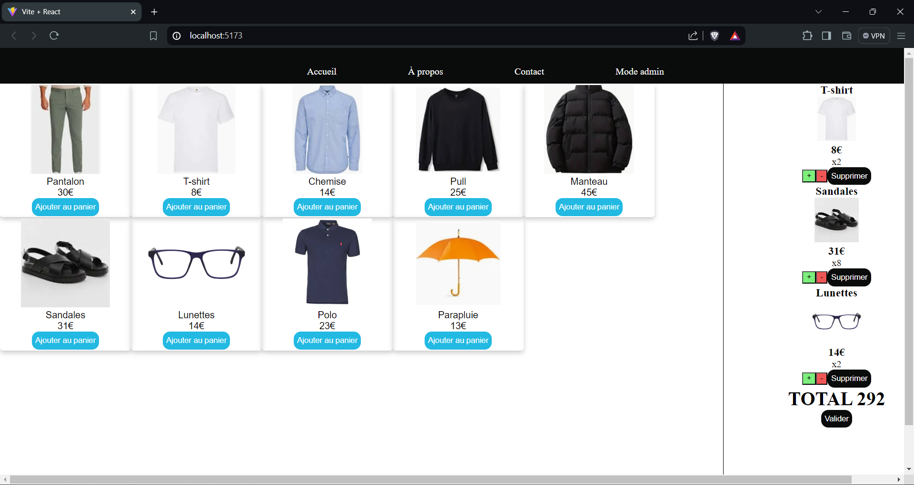
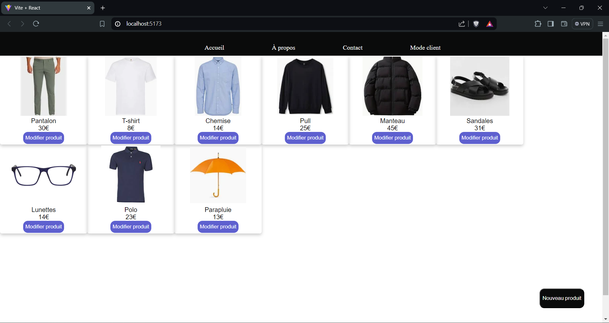
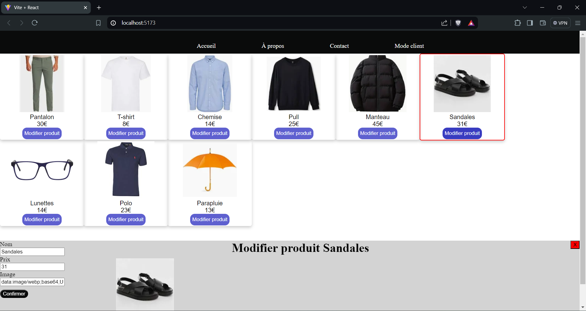

Une simple application React imitant les fonctionnalités d'un site d'achat en ligne.

L'éxécution se fait depuis le répertoire pageProduit/

Pour installer les dépendances : 

```
npm install
```

Pour démarrer

```
npm run dev
```

DefinitionProduits et GestionPanier contiennent les fonctions faisant les opérations et tous les composants dans le fichier components sont plus centrés sur la partie HTML/CSS.

Interface client


Interface admin


Gestion produit
